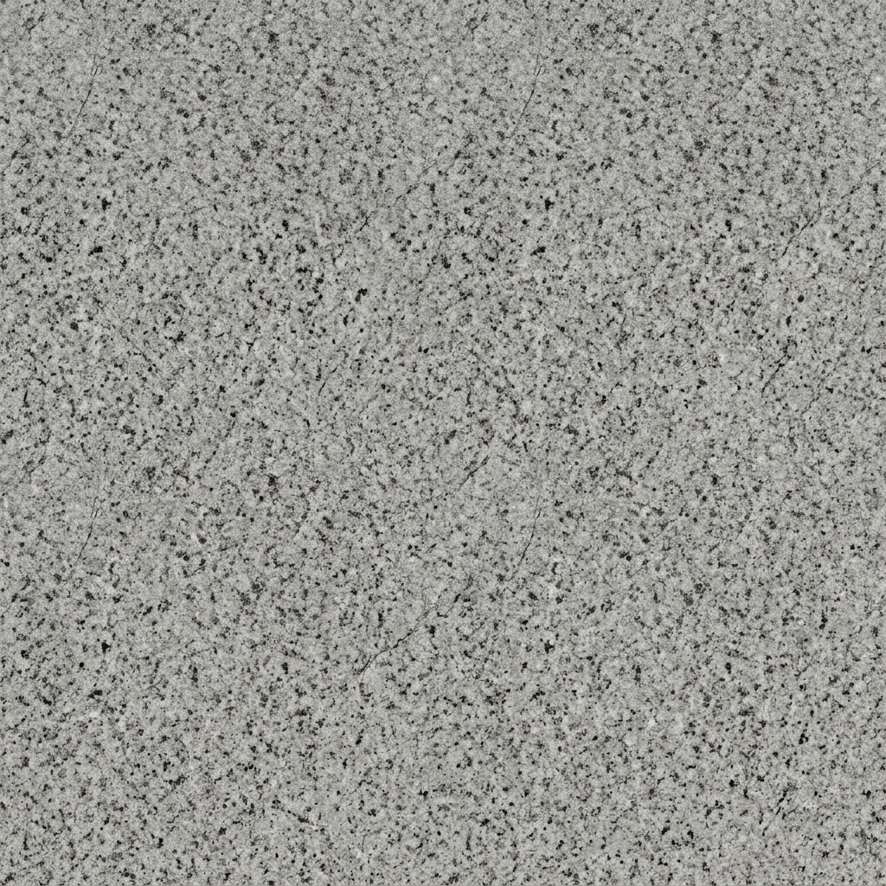

# 🌑 Cylindrical Drop

A premium, immersive 3D cylindrical Tetris experience built with **React**, **Three.js**, and **Zustand**. 

 *(Placeholder for gameplay screenshot)*

## ✨ Features

- **🌀 3D Cylindrical Gameplay:** A unique twist on the classic formula. Rotate the entire tower to find the perfect fit.
- **🗿 Tactile Stone Aesthetics:** Beautifully textured blocks with dynamic lighting, bump mapping, and a "chilled" stone palette.
- **📊 Premium Glassmorphic HUD:** Real-time scoring, line tracking, and difficulty scaling displayed on a sleek, frosted-glass interface.
- **⚙️ Advanced Customization:**
  - **Dynamic Sizing:** Play on Small (32), Standard (64), or Large (96) cylinders.
  - **Starting Fills:** Choose from a clean slate, a classic V-Shape, or a messy Randomized start with cascading gravity.
- **🔊 Immersive Audio:** Procedural "stone clunk" sounds and ambient clear effects with full volume control.
- **🚀 Performance Optimized:** Built using `InstancedMesh` to handle thousands of blocks at 60+ FPS.

## 🎮 Controls

| Action | Key |
| :--- | :--- |
| **Rotate Cylinder** | `Left` / `Right` Arrow or `A` / `D` |
| **Rotate Piece** | `Up` Arrow or `W` |
| **Soft Drop** | `Down` Arrow or `S` |
| **Pause** | `P` |
| **Volume/Mute** | Control Panel |
| **Drag & Spin** | Mouse / Touch Support |

## 🛠️ Technical Stack

- **Framework:** React 18
- **Rendering:** [React Three Fiber](https://github.com/pmndrs/react-three-fiber) & [Three.js](https://threejs.org/)
- **State Management:** [Zustand](https://github.com/pmndrs/zustand)
- **Physics & Logic:** Custom cylindrical coordinate system
- **Styling:** Vanilla CSS + Glassmorphism

## 🚀 Getting Started

1. **Clone the repo:**
   ```bash
   git clone https://github.com/TheCustomCave/Cylindrical-Drop.git
   ```
2. **Install dependencies:**
   ```bash
   npm install
   ```
3. **Run locally:**
   ```bash
   npm run dev
   ```

## 📜 Roadmap

- [x] Core 3D Cylindrical Mechanics
- [x] Scoring and Difficulty Scaling
- [x] Advanced Material Shaders & Lighting
- [x] Game Settings & Presets
- [ ] Mobile-first Vercel Deployment
- [ ] Global Leaderboards
- [ ] Power-ups and Special Block Types

---

Developed with ❤️ by **The Custom Cave**.
